# 🔧 Build Fixes for PureBite

This document explains the build issues encountered and the comprehensive solutions implemented.

## 🚨 Problem

The project was experiencing persistent build failures due to Windows + pnpm + Prisma permission issues:

```
EPERM: operation not permitted, rename '...query_engine-windows.dll.node.tmp' -> '...query_engine-windows.dll.node'
```

## ✅ Solutions Implemented

### 1. **Enhanced Fix Script** (`scripts/fix-prisma.js`)
- **Cross-platform compatibility** (Windows + Unix)
- **Process termination** to free locked files
- **Retry logic** with multiple generation strategies
- **Alternative removal methods** for stubborn files
- **Comprehensive error handling** with manual fix suggestions

### 2. **Safe Build Script** (`scripts/safe-build.js`)
- **Multiple build strategies** with fallbacks
- **Graceful Prisma handling** with validation checks
- **Memory optimization** for large builds
- **Environment variable controls**
- **Detailed error reporting** and troubleshooting

### 3. **Updated Package Scripts**
```json
{
  "build": "node scripts/safe-build.js",           // New safe build
  "build:original": "prisma generate && next build", // Original method
  "build:force": "npm run fix:prisma && next build", // Force fix + build
  "fix:prisma": "node scripts/fix-prisma.js"        // Enhanced fix script
}
```

### 4. **Windows Batch Helper** (`build-windows.bat`)
- **Administrator detection** and recommendations
- **Interactive build options** (Safe/Force/Skip Prisma)
- **Clear error messages** and troubleshooting steps
- **Right-click convenience** for Windows users

### 5. **Environment Variable Controls**
```bash
# Skip Prisma generation if problematic
SKIP_PRISMA_GENERATE=true

# Optimize build process
NEXT_TELEMETRY_DISABLED=1
NODE_OPTIONS=--max-old-space-size=4096
```

## 🚀 Usage

### **Recommended Build Commands**

1. **Normal Build** (recommended):
   ```bash
   pnpm build
   ```

2. **Force Rebuild** (if issues persist):
   ```bash
   pnpm run build:force
   ```

3. **Skip Prisma Build** (emergency):
   ```bash
   SKIP_PRISMA_GENERATE=true pnpm build
   ```

4. **Windows GUI** (double-click):
   ```
   build-windows.bat
   ```

### **Troubleshooting Steps**

1. **First Try**: `pnpm build`
2. **If Failed**: Run as Administrator
3. **Still Failed**: `pnpm run fix:prisma && pnpm build`
4. **Emergency**: `SKIP_PRISMA_GENERATE=true pnpm build`
5. **Last Resort**: Restart computer, then retry

## 🛠️ Technical Details

### **Build Strategy Flow**

```mermaid
flowchart TD
    A[Start Build] --> B{Prisma Client Exists?}
    B -->|Yes| C[Validate Client]
    B -->|No| D[Generate Client]
    C -->|Valid| E[Skip Generation]
    C -->|Invalid| D
    D --> F{Generation Success?}
    F -->|Yes| G[Build Next.js]
    F -->|No| H[Try Alternative Methods]
    H --> I{Any Method Success?}
    I -->|Yes| G
    I -->|No| J[Try Emergency Fix]
    J --> K{Fix Success?}
    K -->|Yes| G
    K -->|No| L[Build Without Prisma]
    G --> M{Build Success?}
    M -->|Yes| N[✅ Complete]
    M -->|No| O[🔧 Show Troubleshooting]
```



### **Permission Issue Handling**

1. **Detection**: Check for `EPERM` errors in Windows
2. **Process Cleanup**: Kill potentially interfering Node.js processes
3. **File System Reset**: Wait for file system to settle
4. **Alternative Tools**: Try different package managers (npx vs pnpm)
5. **Retry Logic**: Multiple attempts with delays

## 📋 Files Modified/Created

- ✅ `scripts/fix-prisma.js` - Enhanced with Windows support
- ✅ `scripts/safe-build.js` - New comprehensive build script
- ✅ `package.json` - Updated build scripts
- ✅ `build-windows.bat` - Windows GUI helper
- ✅ `.env.example` - Added build configuration options
- ✅ `BUILD_FIXES.md` - This documentation

## 🎯 Benefits

- **Reliable Builds**: Multiple fallback strategies
- **Cross-Platform**: Works on Windows, macOS, and Linux
- **User-Friendly**: Clear error messages and solutions
- **Maintainable**: Well-documented and modular approach
- **Performance**: Optimized memory usage and caching

## 💡 Future Improvements

- Monitor Prisma updates for permission fixes
- Consider Docker-based builds for consistency
- Add automated testing for build processes
- Integration with CI/CD pipelines

---

**Need Help?** Check the troubleshooting steps above or run `pnpm run fix:prisma` for automatic fixes.